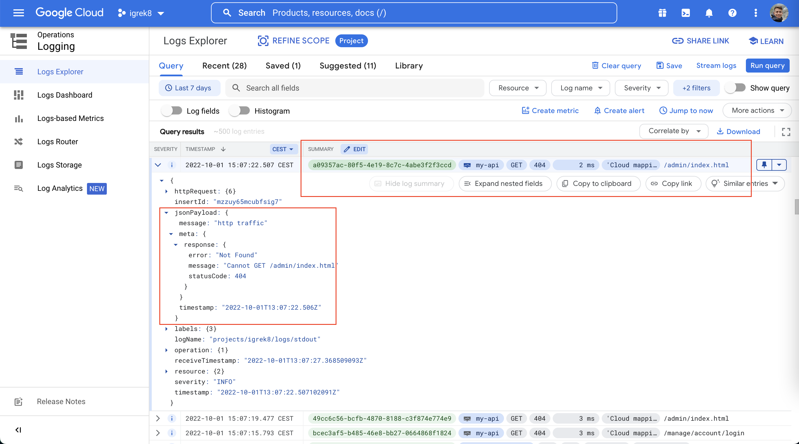

# [Structured logging](https://cloud.google.com/logging/docs/structured-logging) for Nest.js (Express.js) application in GKE

Enables structured logging for Nest.js application running in Google Cloud platform.

[](https://www.npmjs.com/gc-json-logger-nestjs)
[](https://codecov.io/gh/igrek8/gc-json-logger-nestjs)


## Precaution

The logger makes use of [`async_hooks`](https://nodejs.org/api/async_hooks.html#async-hooks) module which is currently **experimental**. However, the use of `async_hooks` mechanism was at basic.

## Installation

```bash
npm install --save \
  gc-json-logger \
  gc-json-logger-express \
  gc-json-logger-nestjs

yarn add \
  gc-json-logger \
  gc-json-logger-express \
  gc-json-logger-nestjs
```

## View in Google Cloud Monitoring



## Usage

### [Demo](./demo)

- [./main.ts](./demo/main.ts)
- [./demo.module.ts](./demo/demo.module.ts)
- [./demo.controller.ts](./demo/demo.controller.ts)
- [./demo.controller.test.ts](./demo/demo.controller.test.ts)

### Shell

```shell
git clone https://github.com/igrek8/gc-json-logger-nestjs
cd gc-json-logger-nestjs
npm install
npm run dev
```

## Log Structure

```jsonc
{"severity":"INFO","time":"2022-10-08T00:00:00.000Z","message":"Starting Nest application...","logging.googleapis.com/operation":{"id":"app"},"meta":{"context":"NestFactory"}}

{"severity":"INFO","time":"2022-10-08T00:00:00.000Z","message":"LoggerModule dependencies initialized","logging.googleapis.com/operation":{"id":"app"},"meta":{"context":"InstanceLoader"}}

{"severity":"INFO","time":"2022-10-08T00:00:00.000Z","message":"AppModule dependencies initialized","logging.googleapis.com/operation":{"id":"app"},"meta":{"context":"InstanceLoader"}}

{"severity":"INFO","time":"2022-10-08T00:00:00.000Z","message":"AppController {/}:","logging.googleapis.com/operation":{"id":"app"},"meta":{"context":"RoutesResolver"}}

{"severity":"INFO","time":"2022-10-08T00:00:00.000Z","message":"Mapped {/trace, POST} route","logging.googleapis.com/operation":{"id":"app"},"meta":{"context":"RouterExplorer"}}

{"severity":"INFO","time":"2022-10-08T00:00:00.000Z","message":"Nest application successfully started","logging.googleapis.com/operation":{"id":"app"},"meta":{"context":"NestApplication"}}

/* HTTP log and LoggerService use the same UUID in "logging.googleapis.com/operation" */
```

## Use with [`jq`](https://github.com/stedolan/jq)

```bash
node ./server.js | jq -r '."logging.googleapis.com/operation".id as $id | { time, severity, $id, message } | join(" ")'
```

## [Trace Request-Response cycle](https://github.com/igrek8/trace-nestjs#openapi)

[Trace-NestJS](https://github.com/igrek8/trace-nestjs) module adds `X-Request-ID` and `X-Response-ID` headers that match operation id.
